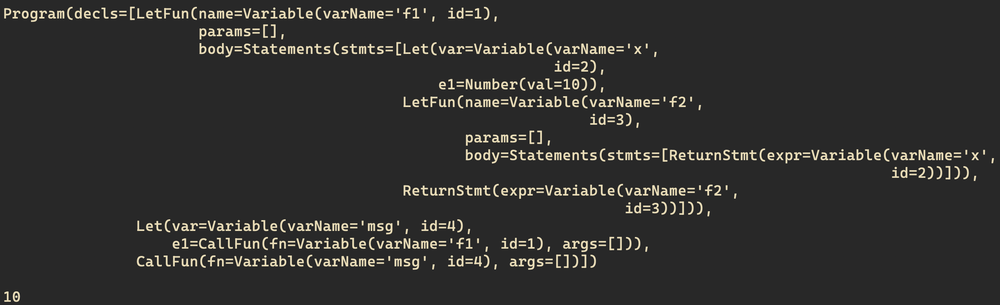
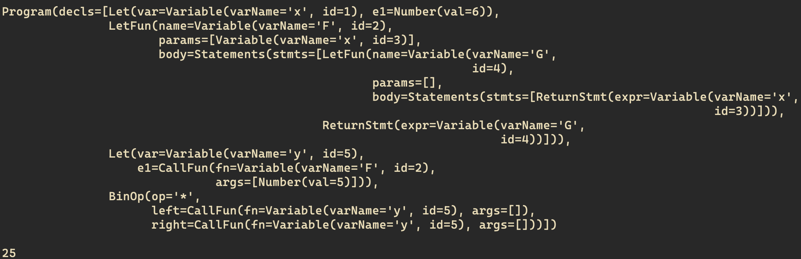
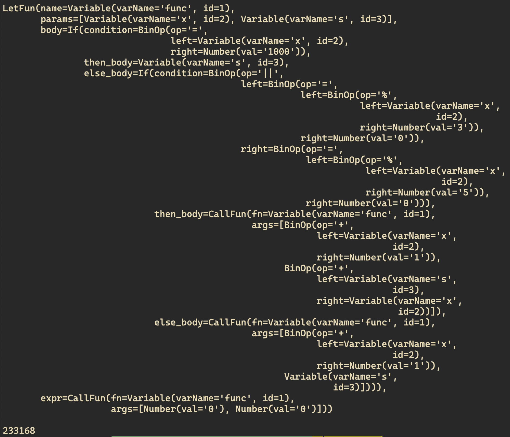
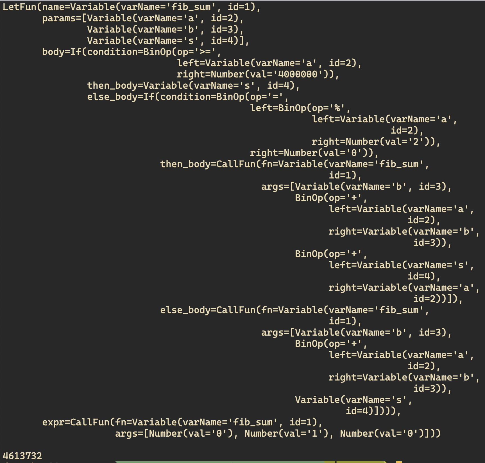
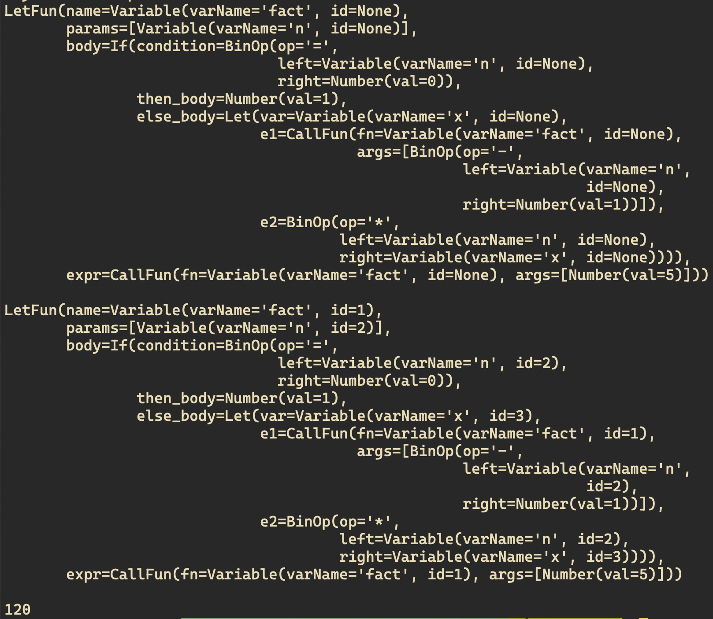
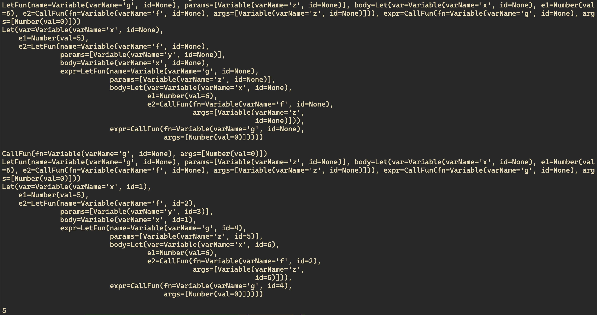
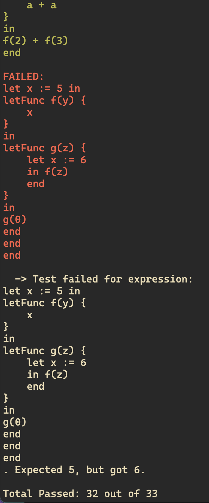

# CS327-Compilers

## Overall Grammar

```
program → declaration* EOF;

declaration → funDecl | varDecl | statement;
funDecl → "letFunc" IDENTIFIER "(" parameters? ")" block;
varDecl → "var" IDENTIFIER (":=" expression)? ";";
statement → ifStmt | printStmt | returnStmt | block | expressionStmt;

ifStmt → "if" expression statement ("else" statement)?;
printStmt → "print" expression ";";
returnStmt → "return" expression ";";
block → "{" declaration* "}";

expressionStmt → expression ";";

parameters → IDENTIFIER ("," IDENTIFIER)*;
```

## Addition of Closures

```python
@dataclass
class FunObj:
    params: List[AST]
    body: AST
    env: Environment

def e(tree: AST, env: Environment = None) -> int | float | bool:

    match tree:
        case LetFun(Variable(varName, i), params, body):
                # Closure -> Copy of Environment taken along
                funObj = FunObj(params, body, env.copy())
                env.add(f"{varName}:{i}", funObj)
                return None

        case CallFun(Variable(varName, i), args):
            fun = env.get(f"{varName}:{i}")
            rargs = [e_(arg) for arg in args]

            # use the environment that was copied when the function was defined
            call_env = fun.env.copy()
            call_env.enter_scope()
            for param, arg in zip(fun.params, rargs):
                call_env.add(f"{param.varName}:{param.id}", arg)

            rbody = e(fun.body, call_env)
            return rbody
```

```python
exp = """
letFunc f1()
{
    var x := 10;
    letFunc f2()
    {
        return x;
    }
    return f2;
}
var msg := f1();
msg();
"""
```

<div align = "center">
    
</div>

```python
exp = """
var x := 6;

letFunc F(x)
{
    letFunc G()
    {
        return x;
    }
    return G;
}

var y := F(5);
y() * y();
"""
```

<div align = "center">
    
</div>

## Functions as First-Class Objects (like variables)

```python
@dataclass
class LetFun(AST):
    name: AST   # considering functions as first-class just like variables else it'll be str
    params: List[AST]
    body: AST
    expr: AST

@dataclass
class CallFun(AST):
    fn: AST     # considering functions as first-class just like variables else it'll be str
    args: List[AST]
```

```python
def resolve(program: AST, env: Environment = None) -> AST:
    if env is None:
        env = Environment()

    def resolve_(program: AST) -> AST:
        return resolve(program, env)

    match program:
        case LetFun(Variable(varName, _), params, body, expr):
                    env.enter_scope()
                    env.add(varName, i := fresh())
                    env.enter_scope()
                    new_params = []
                    for param in params:
                        env.add(param.varName, j := fresh())
                        new_params.append(Variable(param.varName, j))
                    new_body = resolve_(body)
                    env.exit_scope()
                    new_expr = resolve_(expr)
                    env.exit_scope()
                    return LetFun(Variable(varName, i), new_params, new_body, new_expr)

        case CallFun(fn, args):
            rfn = resolve_(fn)
            rargs = [resolve_(arg) for arg in args]
            return CallFun(rfn, rargs)
```

# Updated - Lexer, Parser Added!

Add new token for call - the lexer checks if previously yielded token is `KeyWordToken(letFun)` then the next expected token is the function variable in the definition i.e `VariableToken(<func-name>)`, otherwise it's a `FunCallToken(<func-name>)`.

```python
@dataclass
class FunCallToken(Token):
    funName: str
```

## Project Euler Q1

```python
exp = """
letFunc func(x, s)
{
     if x = 1000 then
         s
     else if x % 3 = 0 || x % 5 = 0 then
         func(x + 1, s + x)
     else
         func(x + 1, s)
}
in
func(0, 0)
end
"""
```

```python
## PROJECT EULER 1
exp = LetFun(Variable("func"),
             [Variable("x"), Variable("s")],
             If(BinOp("=", Variable("x"), Number("1000")),
                Variable("s"),
                If(BinOp("||", BinOp("=", BinOp("%", Variable("x"), Number("3")), Number("0")), BinOp("=", BinOp("%", Variable("x"), Number("5")), Number("0"))),
                   CallFun(Variable("func"), [BinOp("+", Variable("x"), Number("1")), BinOp("+", Variable("s"), Variable("x"))]),
                   CallFun(Variable("func"), [BinOp("+", Variable("x"), Number("1")), Variable("s")])
                   )
                ),
             CallFun(Variable("func"), [Number("0"), Number("0")]))
```

<div align = "center">
    
</div>

## Project Euler Q2

```python
exp = """
letFunc fib(a, b, s)
{
    if a >= 4000000 then
        s
    else if a % 2 = 0 then
        fib(b, a + b, s + a)
    else
        fib(b, a + b, s)
}
in
fib(0, 1, 0)
end
"""
```

```python
## PROJECT EULER 2
exp = LetFun(Variable("fib_sum"),
             [Variable("a"), Variable("b"), Variable("s")],
             If(BinOp(">=", Variable("a"), Number("4000000")),
                Variable("s"),
                If(BinOp("=", BinOp("%", Variable("a"), Number("2")), Number("0")),
                   CallFun(Variable("fib_sum"), [Variable("b"), BinOp("+", Variable("a"), Variable("b")), BinOp("+", Variable("s"), Variable("a"))]),
                   CallFun(Variable("fib_sum"), [Variable("b"), BinOp("+", Variable("a"), Variable("b")), Variable("s")])
                   )
                ),
             CallFun(Variable("fib_sum"), [Number("0"), Number("1"), Number("0")]))
```

<div align = "center">
    
</div>

## Factorial Code

```python
exp = """
letFunc fact(n)
{
    if n = 0 then
        1
    else
        let x := fact(n - 1) in
        n * x
        end
}
in
fact(5)
end
"""
```

<div align = "center">
    
</div>

## Static Scoping

```python
exp = """
let x := 5 in
letFunc f(y) {
    x
}
in
letFunc g(z) {
    let x := 6
    in f(z)
    end
}
in
g(0)
end
end
end
"""
```

<div align = "center">
    
</div>

## Unit Tests

Color coded `unit_tests.py` for better readability. (fail shown deliberately by not passing through `resolve()`)

<div align = "center">
    
</div>

## Older Versions

```python
exp_cond1 = """
if 2 < 3 then
    0 + 5
else
    1 * 6
end
"""
ast = parse(exp_cond1)
dot = visualize_ast(ast)
dot.render("ast_cond", format="png", cleanup=True)
```

<div align = "center">
    
</div>

```python
exp_cond = """
if 2 < 3 then
    if 4 > 5 then
        1
    else
        if 6 <= 7 then
            8
        else
            9
        end
    end
else
    10
end
"""
ast = parse(exp_cond)
dot = visualize_ast(ast)
dot.render("ast_nested_cond", format="png", cleanup=True)
```

<div align = "center">
    
</div>

```python
exp_sq = "\u221a(4 + 12) + \u221a(9)"
ast = parse(exp_sq)
dot = visualize_ast(ast)
dot.render("ast_sqrt", format="png", cleanup=True)
```

&radic;(4 + 12) + &radic;(9)

<div align = "center">
    
</div>
